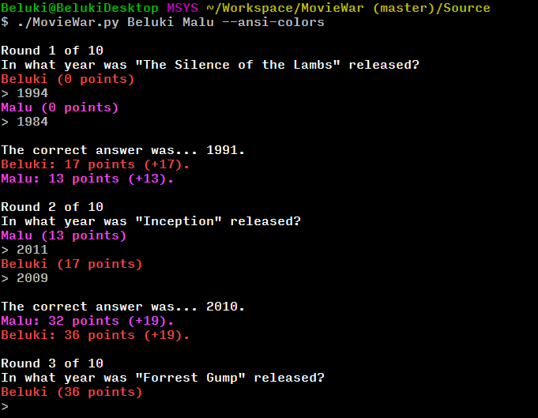

## About

MovieWar is a small terminal game. It's similar to "The Price Is Right"
but players guess movie release dates.

Here is a screenshot:



Interesting features:

* Singleplayer or multiplayer (any number of players supported).
* 7600 movies in the included database.
* Two game modes: random movies or each player chooses a movie for the rest to guess.
* Optionally uses [OMDB][] to find unknown movies and updates the database with them.
* Optional color support (on Windows uses [Colorama][]). No other dependencies.

[Colorama]: https://pypi.python.org/pypi/colorama
[OMDB]: http://www.omdbapi.com

## Usage and command-line options

To play just run the script with the player names as arguments:

```bash
$ MovieWar.py Player1 Player2 Player3...
```

# Command-line options:

The following options that can be used to change the behavior:

* `--colorama` enables color support on cmd.exe or other windows terminals
  when the colorama module is available.

* `--ansi-colors` enables color support on linux or terminals that already
  support them (without needing colorama).

* `--challenge` runs MovieWar in challenge mode. Each round, a player chooses
  a movie by name and the rest try to guess the release date. MovieWar will
  offer similar movie names as suggestions if a movie can't be found.

* `--omdb-search` allows MovieWar to find unknown titles from [OMDB][] when
  a movie can't be found. It will also merge suggestions with the local
  database ones.

* `--roundlimit limit` sets the number of rounds a game will last.
  The default is 10 rounds.

* `--favor older|newer` makes MovieWar choose older or newer movies
  in normal mode. Use this if you find the game too hard.
  It's easier to remember recent movies.

* `--favor-tests number` sets the number of tests that MovieWar
  will do when picking movies in normal mode. With 3 tests, MovieWar will
  choose 3 random movies and pick the oldest/newest depending on the
  `--favor` argument.

* `--no-auto-update` does not add new movies to the database
  when searching OMDB. Alternatively, press CONTROL + C to exit MovieWar.
  It adds all the movies in one go before exiting, not while playing.

* `--filepath path` sets the current movies database to use.
  Useful if you want to have a different file for say... animation/cartoons.

## Scoring

An exact guess is worth 50 points.

An error is (20 points - distance to the movie release year).
For example, if you guess 1990 and the correct release date is 5 years apart
you get 15 points.

Note that it's possible to have a negative score.

When a movie has multiple release dates (e.g. there are like 7 different movies
titled "Jane Eyre"), players get the best score according to the closest
release date to the guess.

## Notes on the movies database

The MovieWar.json file was generated using [MovieWarDBGen][].
It contains 7600 movies.

All the release dates were verified using two sources: [Freebase][] and [OMDB][].
The movies that didn't match exactly on title and release date were discarded.

[MovieWarDBGen]: https://github.com/Beluki/MovieWarDBGen
[Freebase]: https://www.freebase.com
[OMDB]: http://www.omdbapi.com

## Portability

Information and error messages are written to stdout and stderr
respectively, using the current platform newline format and encoding.

The exit status is 0 on success and 1 on errors.

The MovieWar.json file is encoded using UTF-8 without BOM.

MovieWar is tested on Windows 7 and 8 and on Debian (both x86 and x86-64)
using Python 3.4+ and Colorama 0.3.3+. Older versions are not supported.

## Status

This program is finished!

MovieWar is feature-complete and has no known bugs. Unless issues are reported
I plan no further development on it other than maintenance.

## License

Like all my hobby projects, this is Free Software. See the [Documentation][]
folder for more information. No warranty though.

[Documentation]: Documentation

